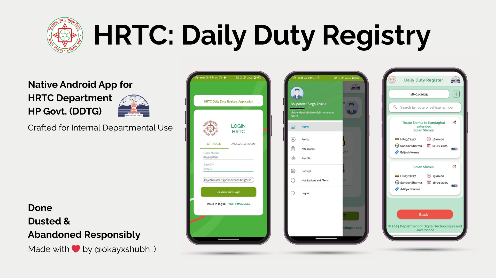
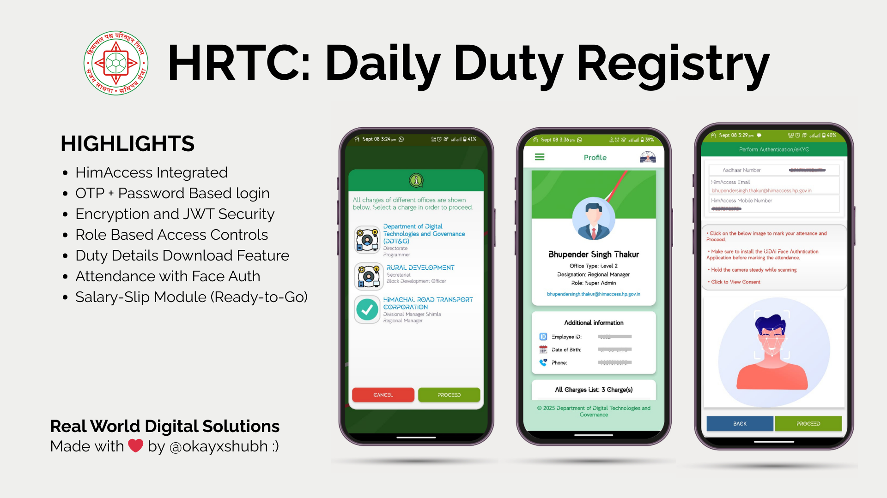

# HRTC Daily Duty Registry App 🚍📋

_Not another boring government app!_  
This is a **Native Android app** built with **Java**, crafted to solve real-world challenges in government departments like **HRTC (Himachal Pradesh Road Transport Corporation)**. Designed for internal departmental use, it makes daily operations smarter, attendance tracking easier, and data management more secure—because government need apps that actually work!

With **Cool UI designs**, smooth interactions, and practical features, this app helps employees track daily duties in a modern way—because government apps shouldn’t look boring!

---

  
*Overview – Because every great app needs an introduction! (even the govt. apps can look cool..)*

  
*Key Highlights – All the good stuff here.. Helping govt. save paper.. Maybe a tree or two!*

---

## 📖 About

This app is built as a **real-world solution** for the daily operations of HRTC and other government departments in Himachal Pradesh.

It provides tools to:  
✔ Track daily duty attendance like a pro – no more paper registers!  
✔ Manage buses, routes, and staff (drivers, conductors, admin… everything!)  
✔ HimAccess integrated – if you know, you know…  
✔ Mark attendance with face authentication – futuristic and fast!  
✔ Maintain privacy and data integrity – your data stays safe and sound  
✔ Beautiful UI designs – finally, a government app that is not so boring!  
✔ Made in limited time for quick delivery – because deadlines and people don’t wait  
✔ Empowering HRTC staff with technology – making solutions simple

Everything you need to streamline field operations is here—with simplicity and style.

---

## 🚀 Features

- 📱 **Native Android app** built using Java
- 🎨 **Beautiful UI designs**, smooth and intuitive
- ✅ Attendance with **face authentication**
- 🚌 Managing buses, staff, routes, and schedules
- ⚙ Works in real-world conditions, for real people
- 💼 Designed specifically for HP Govt operations in HRTC

---

## ⚠ Important Notes

- **Removed hardcoded credentials**: No ID or password for login remains in the app.
- **Removed encryption logic**: The secret key of `AESCrypto.java` file has permanently removed for security.
- **Privacy first**: This project is only viewable. The code and files cannot be pulled or downloaded without permission.

---

## 🛠 Tools Used

| Category          | Tools / Technologies                    |
|------------------|-----------------------------------------|
| 💻 IDE           | Android Studio                          |
| 💬 Language      | Java                                    |
| 🎨 UI Design     | XML Layouts                             |
| 🗄 Database      | PostgreSQL (Server)                     |
| 🔐 Security      | Face Recognition, AES & JWT             |
| 🌐 Version Control| Git & GitHub                            |
| 📡 APIs          | REST APIs (Spring Boot Backend)         |
| 📦 Libraries     | Minimal / Almost none                   |

---

## 📥 How to Use (For Authorized Viewers Only)

This repository is set to **private view-only access**.  
No one can clone or download the code without permission.

For authorized users:
1. Access the project through the GitHub link.
2. View files and documentation.
3. Contact the project owner for credentials or deployment.

---

## 📢 Contribution

This app is built for government use. Contributions are limited and require approval.

---

## 📄 License

Proprietary software — distribution, modification, or reuse is restricted without explicit authorization.

---

## 📬 Contact

For further details or collaboration, please contact the project owner:
✉ chauhanbrijeshkumar16@gmail.com

